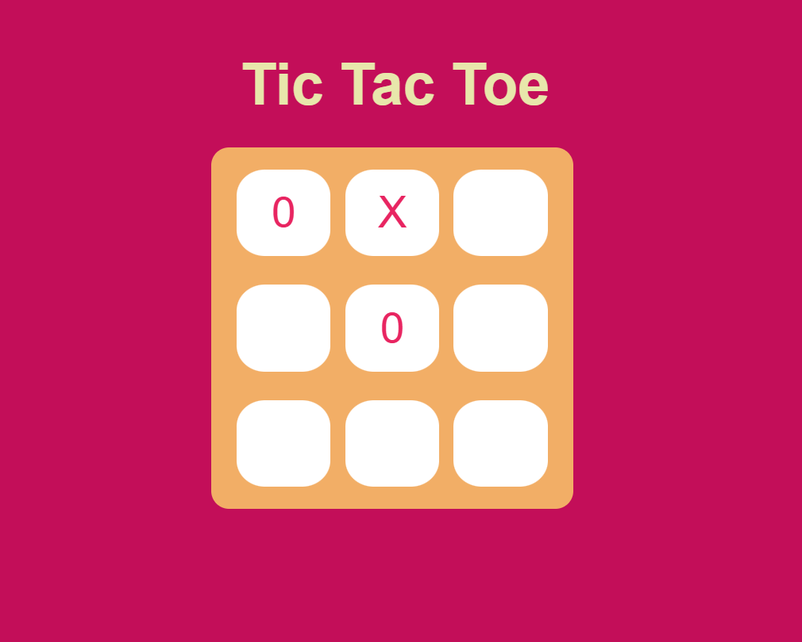

# 🎮 Tic Tac Toe Game

A simple and interactive Tic Tac Toe game built using **HTML**, **CSS**, and **JavaScript**.  
Play against another player in the browser with a clean UI and win-detection logic!

## 🛠️ Technologies Used

- HTML5
- CSS3
- JavaScript (Vanilla)

## 🎯 Features

- Two-player turn-based gameplay
- Winner detection with visual highlight
- Draw detection
- "New Game" button to restart

## 📸 Screenshot

## 🚀 Demo

🌐 Live Preview: [Play Now](https://ayan-maity3105.github.io/tic-tac-toe-game-js/)  

## 📁 Folder Structure

📁 tic-tac-toe-game-js/
├── index.html
├── style.css
├── script.js
└── README.md

## 🧑‍💻 Author

**Ayan Maity**  
📧 [Email](mailto:maityayan473@gmail.com)  
🐙 [GitHub](https://github.com/Ayan-Maity3105)
